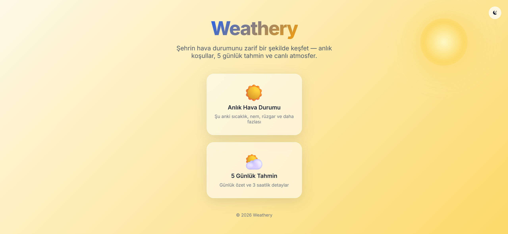
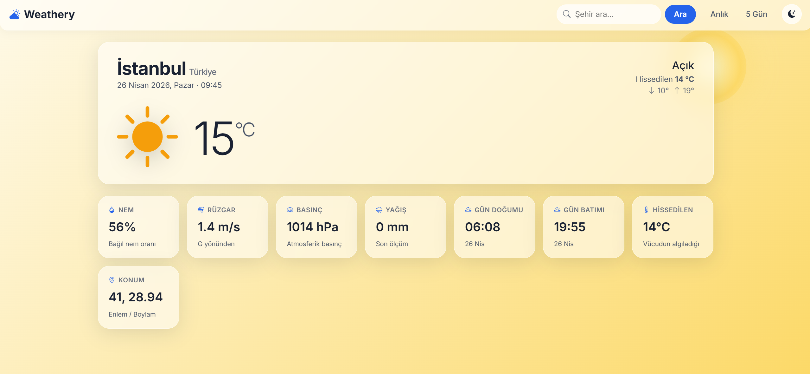
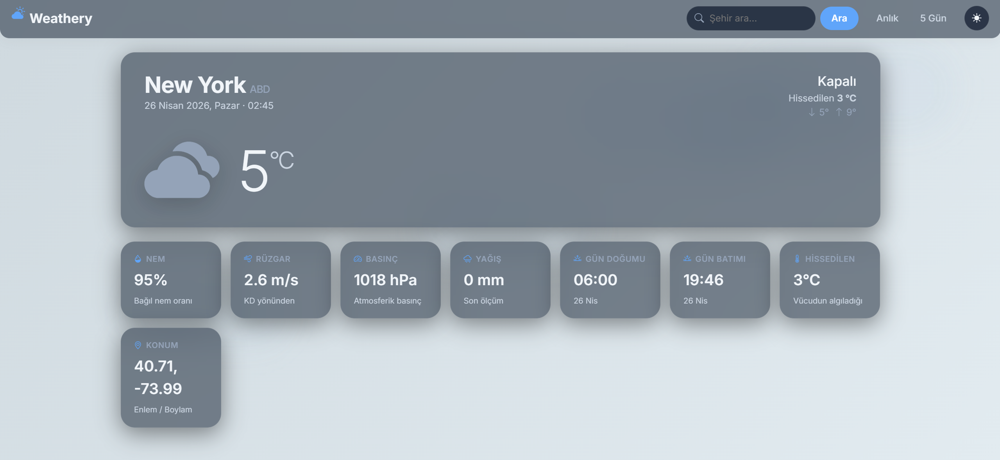
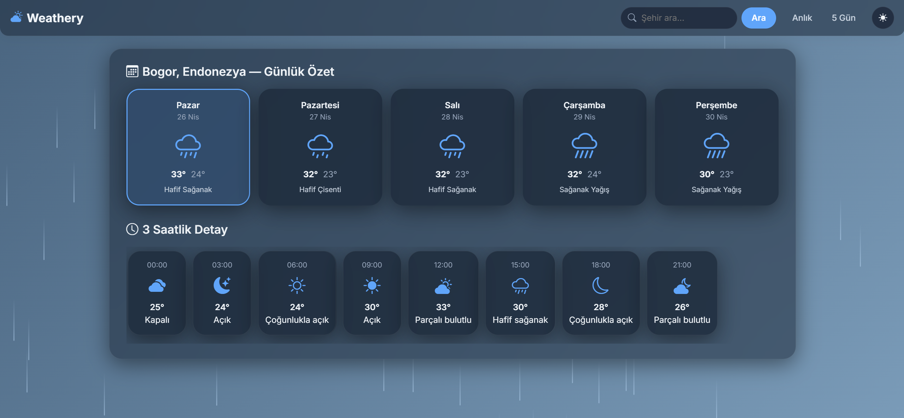
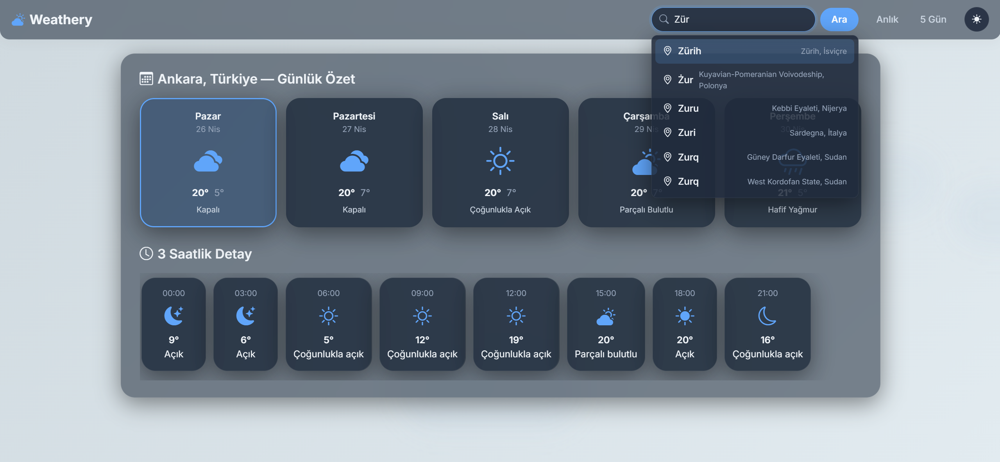

# Weathery

A modern ASP.NET Core MVC weather app powered by [Open-Meteo](https://open-meteo.com/). Glassmorphism UI, condition-aware backgrounds, animated atmospheric effects, dark/light theme, live city autocomplete, and an in-memory response cache that keeps API usage minimal.

---

## Screenshots

### Landing page

| Light | Dark |
|---|---|
|  |  |

### Current weather

| Light | Dark |
|---|---|
|  |  |

### 5-day forecast



### Live search



---

## Features

**Weather data**
- Current conditions: temperature, feels-like, min/max, humidity, wind speed + bearing, pressure, precipitation, sunrise/sunset
- 5-day forecast with daily summary cards and a 3-hour detail strip per day
- City lookup via Open-Meteo geocoding (Turkish-aware results)

**UI**
- Glassmorphism cards on a condition-aware gradient background that shifts with the weather (clear-day, clear-night, rain, snow, clouds, mist, thunder)
- CSS-only atmospheric effects — falling rain, drifting snow, slow-moving clouds, glowing sun, twinkling stars at night
- Light / dark theme toggle, persisted per user (localStorage), respects `prefers-color-scheme` on first load
- Animated number count-ups, smooth fade-up entrance, floating hero icon
- Bootstrap Icons used for all weather glyphs (no PNG CDN dependency)
- Reduced-motion friendly: animations and effects collapse when `prefers-reduced-motion` is set

**Search**
- Live autocomplete with 220 ms debounce — matches city name, region and country from Open-Meteo's geocoder
- Recently searched cities saved in localStorage (last 5)
- Per-row × button to remove a single recent entry, plus a "clear all" footer
- Full keyboard navigation (Arrow Up / Down, Enter, Escape)

**Performance & resilience**
- `IMemoryCache` keyed by city: 24 h for geocoding, 30 min for forecasts, 10 min for current weather, 30 s for misses
- Typed DTOs with safe deserialization, cancellation-token aware HTTP calls
- Single typed `HttpClient` registered through `IHttpClientFactory`

---

## Tech stack

- **.NET 8** · ASP.NET Core MVC · Razor Views
- **Open-Meteo** Forecast + Geocoding APIs (no API key required)
- **Bootstrap 5** + **Bootstrap Icons** (UI primitives only)
- **System.Text.Json** for response parsing
- Vanilla JavaScript (no front-end framework)

---

## Getting started

### Prerequisites

- [.NET 8 SDK](https://dotnet.microsoft.com/download/dotnet/8.0)
- A modern browser

### Run

```bash
git clone https://github.com/emirhantopcuoglu/Weathery.git
cd Weathery
dotnet restore
dotnet run
```

The app starts on the URL printed by Kestrel (typically `http://localhost:5000`). Open that URL in your browser — no API key, no signup, no configuration step.

### Configuration

`appsettings.json` exposes the Open-Meteo endpoints and a default city:

```json
"WeatherApi": {
  "ForecastUrl": "https://api.open-meteo.com/v1/forecast",
  "GeocodingUrl": "https://geocoding-api.open-meteo.com/v1/search",
  "DefaultCity": "Istanbul",
  "Language": "tr"
}
```

Override any of these per environment via `appsettings.{Environment}.json`, environment variables (`WeatherApi__DefaultCity=London`), or User Secrets.

---

## Project layout

```
Controllers/        ASP.NET Core MVC controllers (request orchestration only)
Helpers/            WMO weather code mapping, wind direction, display helpers
Models/             View models (WeatherInfo, ForecastData, DailySummary, ...)
Services/           IWeatherService / IForecastService and OpenMeteoService
  Models/             Open-Meteo response DTOs
Views/              Razor views and shared layout
wwwroot/
  css/weathery.css    Theme, components, animations, atmospheric effects
  js/weathery.js      Theme toggle, autocomplete, recents, count-up, FX
```

---

## How it works

### Request flow

1. Controller receives a city name (or falls back to the configured default).
2. `OpenMeteoService` looks up the city in `IMemoryCache`.
3. On miss, it resolves the city via the geocoding API, then calls `/v1/forecast` once for current + hourly + daily data.
4. Responses are mapped to view models; weather codes are translated into Turkish descriptions, condition classes, and Bootstrap Icons via `WmoWeatherCode`.
5. Razor views render glass cards, condition-aware gradients, and animated effects.

### Caching strategy

| Layer       | Hit window | Notes                                        |
|-------------|------------|----------------------------------------------|
| Geocoding   | 24 hours   | City coordinates rarely change               |
| Current     | 10 minutes | Per city, lower-cased                        |
| Forecast    | 30 minutes | Per city, lower-cased                        |
| Failures    | 30 seconds | Avoids hammering the API on transient errors |

A typical browsing session for a single city makes **at most one** outgoing API call.

---

## API usage

Open-Meteo's free tier allows roughly **10 000 calls per day** for non-commercial use, with no API key. Combined with the cache, the app stays comfortably under that limit even at moderate traffic.
